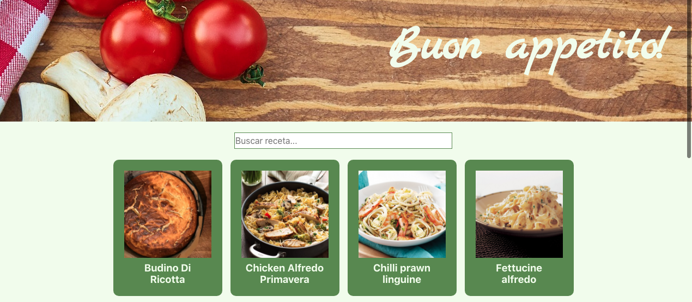

Buscador de Recetas Italianas

El proyecto, página web con un listado de platos italinos, en lo que si pinchas puedes acceder a la receta. 

Lenguaje y herramientas
HTML5 | SCSS | JavaScript | React |

Para comenzar hay que ejecutar varios comandos:

Clonar el repositorio

git clone

Instalar las dependencias del proyecto

npm install

Iniciar el sevidor local

npm start

